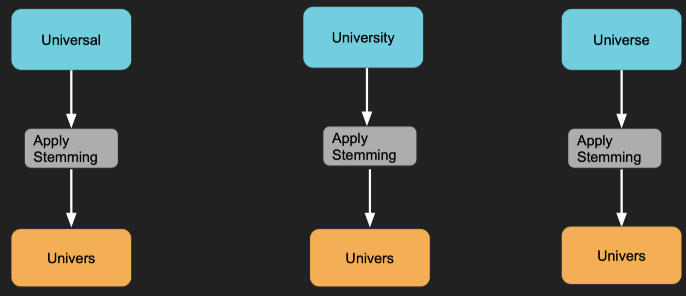
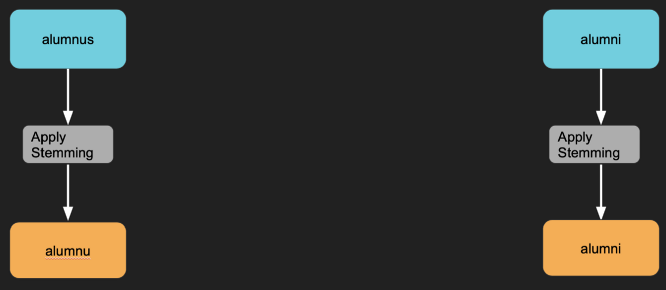
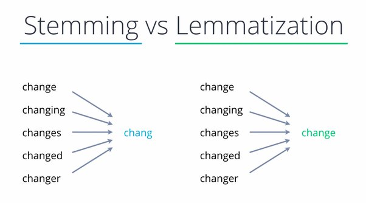
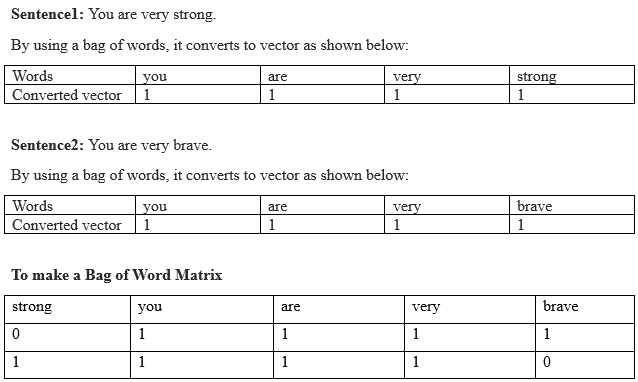
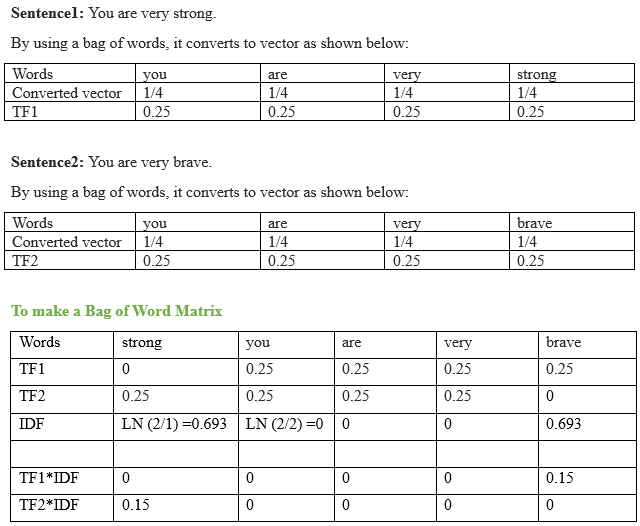

# Preprocessing Text Data

NLP Text preprocessing is a method to clean the text in order to make it ready to feed to models. Noise in the text comes in varied forms like emojis, punctuations, different cases. All these noises are of no use to machines and hence need to clean it.

These are some text preprocessing steps that we can add or remove as per the dataset we have:

Step-1 : Remove newlines & Tabs

Step-2 : Strip HTML Tags

Step-3 : Remove Links

Step-4 : Remove Whitespaces

Step-5 : Remove Accented Characters

Step-6 : Case Conversion

Step-7 : Reducing repeated characters and punctuations

Step-8 : Expand Contractions

Step-9 : Remove Special Characters

Step-10: Remove Stopwords

Step-11: Correcting Mis-spelled words

Step-12: Lemmatization / Stemming

#

# Tokenizing


While there's of course been an incredible amount of NLP research in the past decade, a key under-explored area is Tokenization, which is simply the process of converting natural text into smaller parts known as "tokens." 

Tokens here is an ambiguous term. A token that can refer to words, subwords, or even characters. It basically refers to the process of breaking down a sentence into its constituent parts. For instance, in the statement: "Coffee is superior than chai" One way to split the statement into smaller chunks is separate out words from the sentence i.e. "Coffee", "is" "superior", "than", "chai" That's the essence of Tokenization.


As we know that NLP is used to build applications such as sentiment analysis, QA systems, languag translation, smart chatbots, voice systems, etc., hence, in order to build them, it becomes vital to understand the pattern in the text. The tokens, mentioned above, are very useful in finding and understanding these patterns. We can consider tokenization as the base step for other recipes such as stemming and lemmatization.


As we know that NLP is used to build applications such as sentiment analysis, QA systems, languag translation, smart chatbots, voice systems, etc., hence, in order to build them, it becomes vital to understand the pattern in the text. The tokens, mentioned above, are very useful in finding and understanding these patterns. We can consider tokenization as the base step for other recipes such as stemming and lemmatization.

# Stemming:
Stemming is the process of reducing a word to its word stem that affixes to suffixes and prefixes or to the roots of words known as a lemma. Stemming is important in natural language understanding (NLU) and natural language processing (NLP).

 For example, an error can reduce words like laziness to lazi  instead of lazy.

#### Problems in Stemming:
There are two issues we face in stemming; those are ‘Over-Stemming’ & ‘Under-Stemming’.

#### Over-Stemming :
A simple explanation of over-stemming is when you pass words with different meanings but the stemmer is returning the same stem word for all. Have a look at the diagram below then I’ll show you it in practical implementation too.



We all know these three words Universal,University & Universe are different in meaning but still we are returned with the same stemmed word for all this is called over-stemming where the meaning is different but stemmer is returning us the same root word for words with different meaning.

#### Under-Stemming :

Under-stemming is in a way you can say it's opposite of over-stemming. Here you pass words with the same meaning but stemmer returns you the different root words.



Above two words are the same, the only difference is singular and plural so we should have the same root word for both but this isn’t happening here it is providing us with two different root words.

# Lemmatization:
Lemmatization is a linguistic term that means grouping together words with the same root or lemma but with different inflections or derivatives of meaning so they can be analyzed as one item. The aim is to take away inflectional suffixes and prefixes to bring out the word’s dictionary form.
For example, to lemmatize the words “cats,” “cat’s,” and “cats’” means taking away the suffixes “s,” “’s,” and “s’” to bring out the root word “cat.” Lemmatization is used to train robots to speak and converse, making it important in the field of artificial intelligence (AI) known as “natural language processing (NLP)” or “natural language understanding.”




#
# Bag of Words (BOW) or Countvectorizer
It is used to retrieve the information in a form vector or number from the words/phrases. This solves the classification problem to some extent in natural language processing.
The working function of a bag of words is to count the occurrence of the word in the phases disregarding the semantic information and don’t know where in the phases or document. It is very easy to grasp the concept and implement it.

Example



#
# Term frequency and inverse document frequency (TF-IDF)

In this model, some semantic information is collected by giving importance to uncommon words rather than common words.
The term IDF means assigning a higher weight to the rare words in the document.
TF-IDF = TF*IDF
Example:



In the above example, uncommon words have more weights and common words have fewer weights.

Terms in TF-IDF
Document frequency: The document frequency tells how often a word will occur in the whole collection of sentences, the information is global and not specific to any sentence.

DF = number of documents containing a given term(d)/total number of documents in corpus(D)

#
# Difference between Bag of Words (BOW) and TF-IDF in NLP with Python

1. Bag of Words: Converting words to numbers with no semantic information.

2. TF-IDF: It is also converting the words to numbers or vectors with some weighted information.

A Semantic Information is an information that carries significance or meaning for a given system or conceptual entity

#
# Similarity of words using Gensim

What is the most similar word to “king”? Is it “Canute” or is it “crowned”? It depends on what you mean by similar. “King” can be interchanged with “Canute”, but its attribute is “crown”. We will discuss how to perform these two kinds of similarity from word embeddings. Also touch on how to deal with the common issues of rare, frequent, and out-of-vocabulary words.

#### What is Gensim?
Gensim is an open-source library for unsupervised topic modeling and natural language processing, using modern statistical machine learning.


```bash
model = gensim.models.Word2Vec (documents, size=150, window=10, min_count=2, workers=10)
model.train(documents,total_examples=len(documents),epochs=20)

# get everything related to stuff on the bed
w1 = ["bed",'sheet','pillow']
w2 = ['couch']
model.wv.most_similar (positive=w1,negative=w2,topn=10)
```
Output:

[('duvet', 0.7087066173553467),

 ('blanket', 0.6890629529953003),

 ('mattress', 0.6853978633880615),

 ('matress', 0.667702317237854),

 ('quilt', 0.6663302779197693),

 ('pillowcase', 0.6542825698852539),

 ('sheets', 0.6388118267059326),

 ('foam', 0.635508120059967),

 ('pillows', 0.6337054371833801),

 ('pillowcases', 0.6203763484954834)]

```bash

# similarity between two different words
model.wv.similarity(w1="dirty",w2="smelly")
```
0.7617112

#
# Text Summarization
Text Summarization is one of the techniques of Natural Language Generation, having the goal to produce a concise summary while preserving key information and overall meaning.

Text summarization methods can be grouped into two main categories: 

Extractive and 

Abstractive methods.

### Extractive Text Summarization

It is the traditional method developed first. The main objective is to identify the significant sentences of the text and add them to the summary. You need to note that the summary obtained contains exact sentences from the original text.


#### TextRank algorithm

TextRank is an extractive summarization technique. It is based on the concept that words which occur more frequently are significant. Hence , the sentences containing highly frequent words are important. Based on this , the algorithm assigns scores to each sentence in the text . The top-ranked sentences make it to the summary.

#### Text Summarization using Lex Rank:

This is an unsupervised machine learning based approach in which we use the textrank approach to find the summary of our sentences. Using cosine similarity and vector based algorithms, we find minimum cosine distance among various words and store the more similar words together.

#### Text Summarization using LSA (Latent semantic analysis)

Latent Semantic Analysis is a unsupervised learning algorithm that can be used for extractive text summarization. It extracts semantically significant sentences by applying singular value decomposition(SVD) to the matrix of term-document frequency.

#### Text Summarization using Luhn

Luhn Summarization algorithm’s approach is based on TF-IDF (Term Frequency-Inverse Document Frequency). It is useful when very low frequent words as well as highly frequent words(stopwords) are both not significant.
#### Text Summarization using KL-Sum

Another extractive method is the KL-Sum algorithm. It selects sentences based on similarity of word distribution as the original text. It aims to lower the KL-divergence criteria (learn more). It uses greedy optimization approach and keeps adding sentences till the KL-divergence decreases

### Abstractive Text Summarization
It is a more advanced method, many advancements keep coming out frequently(I will cover some of the best here). The approach is to identify the important sections, interpret the context and reproduce in a new way. This ensures that the core information is conveyed through the shortest text possible. Note that here, the sentences in summary are generated, not just extracted from original text.

#### Summarization with T5 Transformers

T5 is an encoder-decoder model. It converts all language problems into a text-to-text format.

First, you need to import the tokenizer and corresponding model through below command.

It is preferred to use T5ForConditionalGeneration model when the input and output are both sequences.

#### Summarization with BART Transformers

transformers library of HuggingFace supports summarization with BART models.

Import the model and tokenizer. For problems where there is need to generate sequences , it is preferred to use BartForConditionalGeneration model.

” bart-large-cnn” is a pretrained model, fine tuned especially for summarization task. You can load the model using from_pretrained() method

#### Summarization with GPT-2 Transformers

GPT-2 transformer is another major player in text summarization, introduced by OpenAI. Thanks to transformers, the process followed is same just like with BART Transformers. First, you have to import the tokenizer and model. Make sure that you import a LM Head type model, as it is necessary to generate sequences. Next, load the pretrained gpt-2 model and tokenizer .

After loading the model, you have to encode the input text and pass it as an input to model.generate()

#### Summarization with XLM Transformers

Another transformer type that could be used for summarization are XLM Transformers.

You can import the XLMWithLMHeadModel as it supports generation of sequences.You can load the pretrained xlm-mlm-en-2048 model and tokenizer with weights using from_pretrained() method.

The nexts steps are same as the last three cases. The encoded input text is passed to generate() function with returns id sequence for the summary. You can decode and print the summary.


